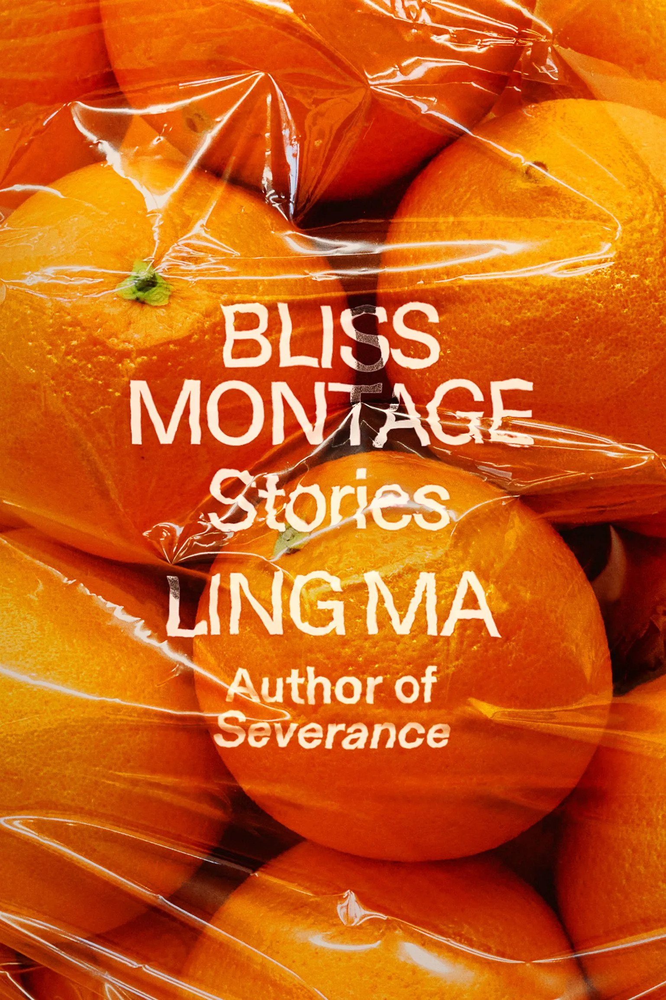

# 📚 &nbsp; October 2023

 

## Titles  
> A list of 6 novels and short story collections  

   

**Banyan Moon** by Thao Thai &nbsp; \| &nbsp; *novel*  

  

&#8594; [goodreads link](https://www.goodreads.com/book/show/62800971-banyan-moon?ref=nav_sb_ss_1_10)  

 
 

**The Seven Moons of Maali Almeida** by Shehan Karunatilaka &nbsp; \| &nbsp; *novel*    

  

&#8594; [goodreads link](https://www.goodreads.com/book/show/57224204-the-seven-moons-of-maali-almeida?ref=nav_sb_ss_1_11)  

 
   

**Dust Child** by Nguyễn Phan Quế Mai  &nbsp; \| &nbsp; *novel*  

  

&#8594; [goodreads link](https://www.goodreads.com/book/show/60831918-dust-child?from_search=true&from_srp=true&qid=E8IXl0zd3x&rank=1)  

 
   

**Beasts of a Little Land** by Juhea Kim  &nbsp; \| &nbsp; *novel*   

  

&#8594; [goodreads link](https://www.goodreads.com/en/book/show/57151981)  

 
 

**Bliss Montage** by Ling Ma &nbsp; \| &nbsp; *short story collection*      

  

&#8594; [goodreads link](https://www.goodreads.com/book/show/60243188-bliss-montage?ref=nav_sb_ss_5_5)  

 
 

**Tomorrow in Shanghai** by May-lee Chai &nbsp; \| &nbsp; *short story collection*     

  

&#8594; [goodreads link](https://www.goodreads.com/book/show/58722207-tomorrow-in-shanghai)  

   

---

 

## Survey    
> via Google Forms      

### &#10148; [Which book should we read? When should we meet?](https://forms.gle/8FRJ7co2KtsV9sX68)    

Trying something a bit different here: Rank your top 3 titles, and I'll [score the results](https://www.si.com/fannation/nba/fastbreak/news/2022-23-nba-awards-media-poll-results-nba-most-valuable-player); the title with the most points is our book for October!    

   
  
   
  
   
  
   
  
   
  
      
  
`Made in BKLYN, made with 💙.`
